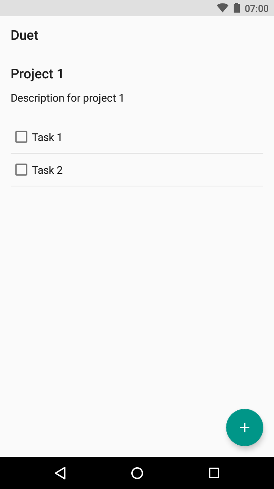

# Duet

Duet is an open-source task management application with support for projects, tasks and sub-tasks, based upon the GTD methodology by Sir David Allen. 

	
	
	

Duet is very much still a work-in-progress, and I will be updating this repo as and when new features are added. For a list of current working features and features coming soon, take a look at the following sections. 

## Current features

* Add projects with name and description

## Upcoming features

* Add tasks under projects
* Open projects to view the description, and the list of tasks

## Contribute

Duet is an open-source project, and as such was primarily created so that I could play with Realm, and learn a little bit of Android. Once I have the basic features ready for the app, I will open the project to contributions from the community. 